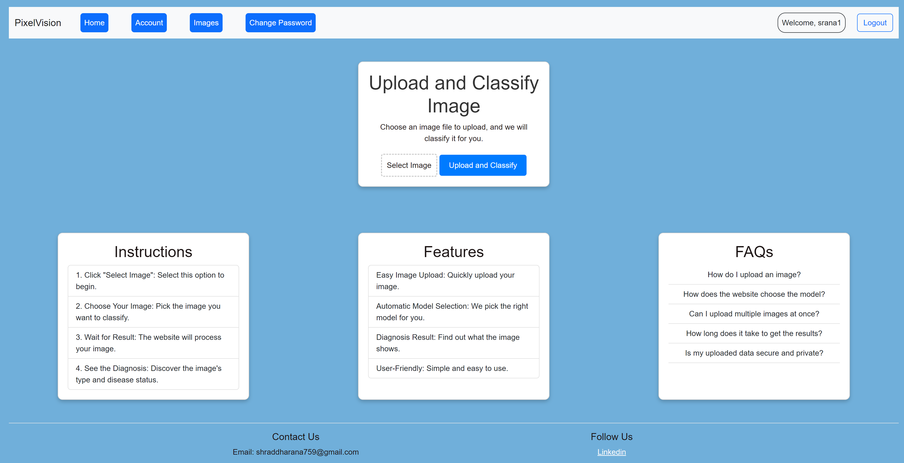

# Medical-Image-classification
The PixelVision project is a user-friendly medical image classification web application that leverages the capabilities of Django, a high-level Python web framework, a containerization platform, to perform image recognition/classification tasks. The project aims to provide an accessible platform for users to upload images and receive real-time recognition results.

# Running the project
Create an environment, pip requirements and run server.
1. python3 -m venv env
2. source env/bin/activate
3. pip install -r requirements.txt
4. cd pixelvision
5. python3 manage.py runserver

